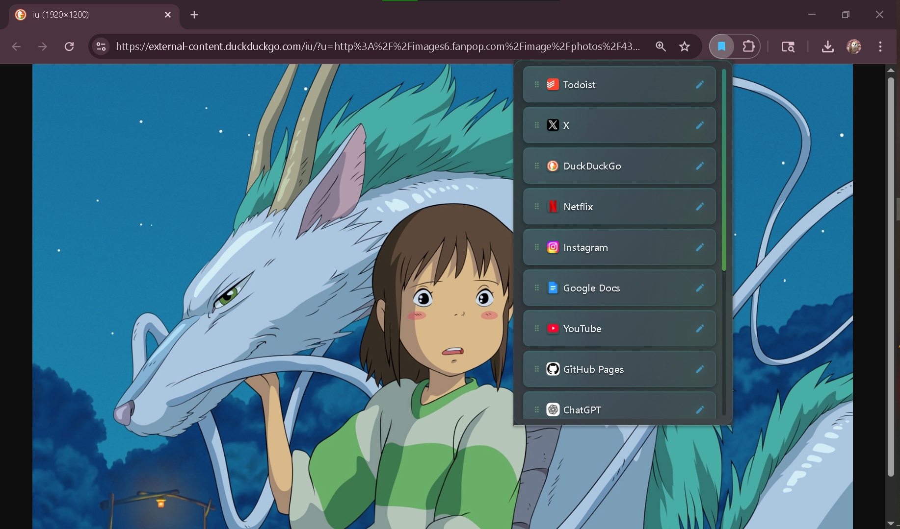

# Mini Bookmark Bar

Since I have a tiny laptop screen, I wanted to hide my bookmark bar in Chrome. Basically, this extension takes all of your bookmarks from your bookmark bar, except the links inside your folders. I mostly just made this to see how chrome extensions work. 

## Features
* Rename bookmarks
* Rearrange bookmarks 

If you want to try it, go to `chrome://extensions/`. Then click "Load Unpacked", then you can pin the Mini Bookmark Bar.
